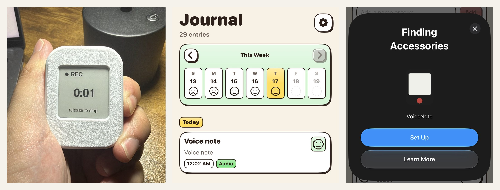
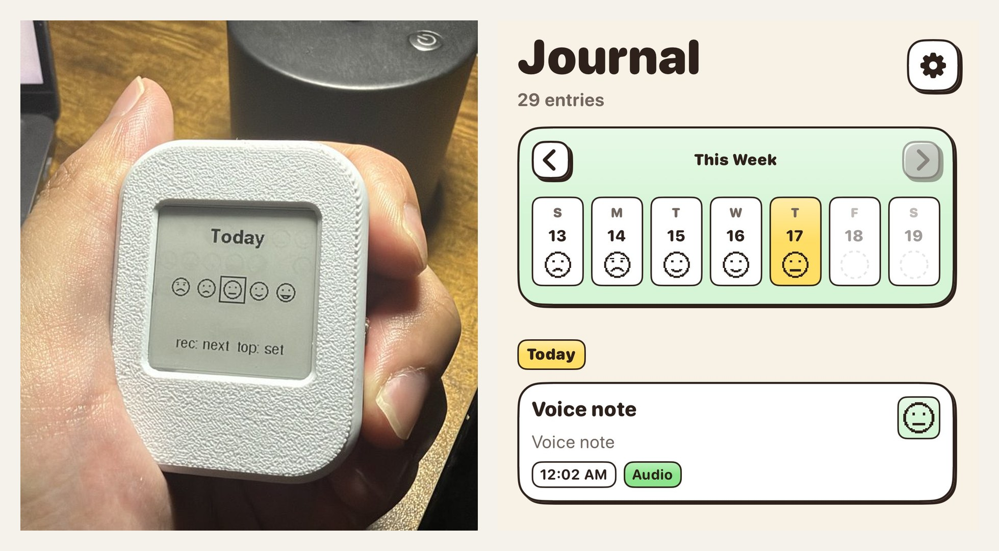

# VoiceNotes

A pocket e-ink device on an ESP32-S3 that records voice notes and logs a daily mood check-in, synced to an iPhone over BLE. No WiFi, no server, no account.

## Why BLE over WiFi for ESP32 devices?

WiFi might be generally faster, but there is so much friction to setting it up and pairing it with your phone, especially if you are making something to bring outside (public transit schedule checker, agent monitor, ...). Bluetooth events can wake your app in the background to sync data when you want to, without ever having to hard code your home WiFi creds in the script.

Also, all of the workload you might ever send to and from this device is probably a few kilobytes, which will be sent in a couple of seconds at most.

## How it works

The mic is encoded as IMA ADPCM on the ESP32 and streamed live to the phone over BLE. The phone writes a WAV and sends it for transcription. Of course you can make a local version, but most local models are really bad at Vietnamese, which is a hard requirement in my case.

- `firmware/` is the Arduino sketch for the device (`firmware/build.sh` builds and uploads with `arduino-cli`)
- `ios/` is the iOS app

## Make your own

Both sides are built on [EasyBLE](https://github.com/ntna141/EasyBLE), an Arduino library + Swift package that pairs through the system accessory picker (AccessorySetupKit), auto-reconnects, sends text/image messages both ways, and exposes a streaming channel that shows up as an `AsyncStream` on iOS.
